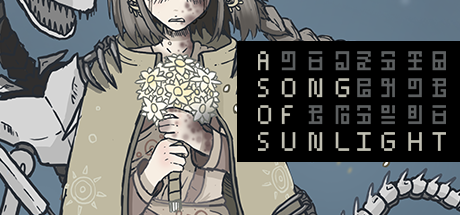
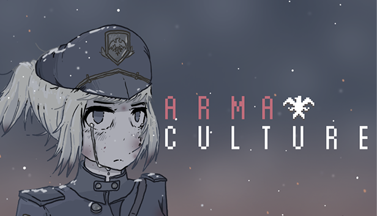

# Game Code portfolio for Luca Sandoval

A selection of code from various projects I have worked on. Each will feature a README.md that gives context about the purpose of the 
code in the larger project. Most of the code is taken from my current project "A Song of Sunlight," but all my projects are linked below.

**[A Song Of Sunlight](https://store.steampowered.com/app/2263250/A_Song_Of_Sunlight/?curator_clanid=42575477)**
- My upcoming second game, being developed solo. 
- Set in an extremely distant future, the player is tasked with finding salvation for their people by descending an endless megastructure stretching into the earth. Explores the breakdown of human relationships and the human desire to bury past mistakes.

**[ArmaCulture](https://store.steampowered.com/app/1617190/ArmaCulture/?curator_clanid=42575477)**
- Steam score: 9/10, 10,000 downloads. 
- Indie factory-builder RPG set in a fictional war following a farmer attempting to survive under a fascist regime. Developed and published on Steam by me, all art, music, programming, and writing was done by me independently.

