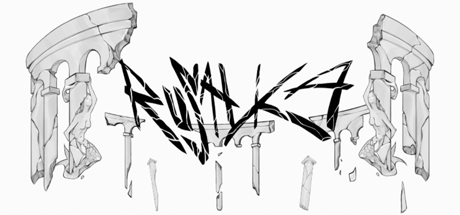

# Game Code portfolio for Luca Sandoval

**Hello! If you'd like to know where to start, please take a look at the Sound System directory.**

This repository serves as a code selection from various projects I have worked on solo or in a team. I wrote all the code featured in this repository. Each directory will feature a README.md that gives context about the purpose of the 
code samples in the larger project. Links to some of the projects featured:

**[A Song Of Sunlight](https://store.steampowered.com/app/2263250/A_Song_Of_Sunlight/?curator_clanid=42575477)**

- My upcoming second game, is being developed solo. 
- Set in an extremely distant future, the player is tasked with finding salvation for their people by descending an endless megastructure stretching into the earth. Explores the breakdown of human relationships and the human desire to bury past mistakes.

**[Schematica](https://store.steampowered.com/app/3725600/Schematica/)**

- Developed Schematica, a fully procedural action rougelike, on a team of four as a lead programmer.

**[Rusalka](https://ragefordragons.itch.io/rusalka)**

- I Developed Rusałka, a 2D narrative platformer, alongside a team of eight other interdisciplinary students. 
- Implemented core gameplay systems, including player controller and physics, sound control, and menus.

**[ArmaCulture](https://store.steampowered.com/app/1617190/ArmaCulture/?curator_clanid=42575477)**

- Steam score: 9/10, 10,000 downloads. 
- Indie factory-builder RPG set in a fictional war following a farmer attempting to survive under a fascist regime. Developed and published on Steam by me, all art, music, programming, and writing was done by me independently.
